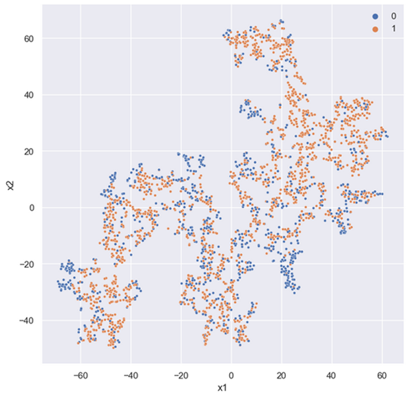

# Time series detection using autoencoder based feature engineering

I created a model as part of my Master's thesis that aims to extract relevant information or features from a wide range of time series data, specifically using data from the [UEA $ UCR Repository](https://www.timeseriesclassification.com/). The final version of the model is able to effectively condense the time series into a vector of only 4 values, and can handle time series of any length, though a maximum length must be set before training.The model is based on an autoencoder architecture, and I explored two different architectures: a Convolution Autoencoder and a Variational Convolution Autoencoder. This feature extraction method is particularly effective for time series data with low entropy, but struggles with those of high entropy. To evaluate the model's performance, the features extracted from the latent space were compared with the catch22 feature set on a detection task (binary classification). A combined autoencoder-catch22 model was also created, which had an AUC score of 0.9416, which was slightly lower than the catch22 model alone, but had more than double the speed on inference.

## Latent space visualizations

| Dataset | t-SNE   | UMAP  |
| :-----------: | :-----------: | :-----------: |
| ECGFiveDays |   |   |
| PhalangesOutlinesCorrect  |   |   |
| Wafer  |   |   |

## Accuracies on all datasets

| **Dataset**                   | **Variational Convolution Autoencoder ** | **Convolution Autoencoder** | **Catch22** | **Combined** |
| ----------------------------- | ------------------------------------------- | --------------------------- | ----------- | ------------ |
| BeetleFly                     | 0.650000                                    | 0.700000                    | 0.750000    | 0.750000     |
| BirdChicken                   | 0.700000                                    | 0.750000                    | 0.700000    | 0.650000     |
| Chinatown                     | 0.763848                                    | 0.912536                    | 0.623907    | 0.853090     |
| Coffee                        | 0.714286                                    | 0.750000                    | 0.964286    | 0.964286     |
| Computers                     | 0.488000                                    | 0.560000                    | 0.716000    | 0.720000     |
| DistalPhalanxOutlineCorrect   | 0.746377                                    | 0.728261                    | 0.804348    | 0.786232     |
| DodgerLoopGame                | 0.521739                                    | 0.717391                    | 0.630435    | 0.673913     |
| DodgerLoopWeekend             | 0.985507                                    | 0.920290                    | 0.963768    | 0.920290     |
| ECG200                        | 0.770000                                    | 0.800000                    | 0.770000    | 0.790000     |
| ECGFiveDays                   | 0.497096                                    | 0.571429                    | 0.497096    | 0.691057     |
| Earthquakes                   | 0.589928                                    | 0.654676                    | 0.705036    | 0.712230     |
| FordA                         | 0.615909                                    | 0.646212                    | 0.906061    | 0.879545     |
| FordB                         | 0.572840                                    | 0.554321                    | 0.771605    | 0.734568     |
| FreezerRegularTrain           | 0.840702                                    | 0.885614                    | 0.997193    | 0.997193     |
| FreezerSmallTrain             | 0.735789                                    | 0.829474                    | 0.997544    | 0.997544     |
| GunPoint                      | 0.753333                                    | 0.800000                    | 0.906667    | 0.886667     |
| GunPointAgeSpan               | 0.867089                                    | 0.867089                    | 0.920886    | 0.943038     |
| GunPointMaleVersusFemale      | 0.933544                                    | 0.943038                    | 0.974684    | 0.939873     |
| GunPointOldVersusYoung        | 0.888889                                    | 0.895238                    | 1.000000    | 1.000000     |
| Ham                           | 0.533333                                    | 0.542857                    | 0.590476    | 0.638095     |
| HandOutlines                  | 0.878378                                    | 0.802703                    | 0.875676    | 0.875676     |
| Herring                       | 0.625000                                    | 0.562500                    | 0.453125    | 0.500000     |
| HouseTwenty                   | 0.731092                                    | 0.647059                    | 0.899160    | 0.873950     |
| ItalyPowerDemand              | 0.755102                                    | 0.790087                    | 0.848397    | 0.830904     |
| Lightning2                    | 0.655738                                    | 0.622951                    | 0.721311    | 0.737705     |
| MiddlePhalanxOutlineCorrect   | 0.738832                                    | 0.704467                    | 0.752577    | 0.810997     |
| MoteStrain                    | 0.746006                                    | 0.781150                    | 0.759585    | 0.778754     |
| PhalangesOutlinesCorrect      | 0.705128                                    | 0.671329                    | 0.797203    | 0.756410     |
| PowerCons                     | 0.855556                                    | 0.838889                    | 0.927778    | 0.933333     |
| ProximalPhalanxOutlineCorrect | 0.756014                                    | 0.742268                    | 0.828179    | 0.831615     |
| SemgHandGenderCh2             | 0.835000                                    | 0.846667                    | 0.898333    | 0.916667     |
| ShapeletSim                   | 0.500000                                    | 0.544444                    | 1.000000    | 1.000000     |
| SonyAIBORobotSurface1         | 0.727121                                    | 0.597338                    | 0.901830    | 0.901830     |
| SonyAIBORobotSurface2         | 0.779643                                    | 0.792235                    | 0.882476    | 0.900315     |
| Strawberry                    | 0.781081                                    | 0.867568                    | 0.921622    | 0.894595     |
| ToeSegmentation1              | 0.618421                                    | 0.513158                    | 0.771930    | 0.741228     |
| ToeSegmentation2              | 0.576923                                    | 0.646154                    | 0.823077    | 0.815385     |
| TwoLeadECG                    | 0.703248                                    | 0.729587                    | 0.827041    | 0.676910     |
| Wafer                         | 0.988157                                    | 0.983777                    | 0.994971    | 0.992862     |
| Wine                          | 0.666667                                    | 0.555556                    | 0.592593    | 0.703704     |
| WormsTwoClass                 | 0.454545                                    | 0.519481                    | 0.818182    | 0.818182     |
| Yoga                          | 0.729000                                    | 0.739000                    | 0.735000    | 0.748667     |